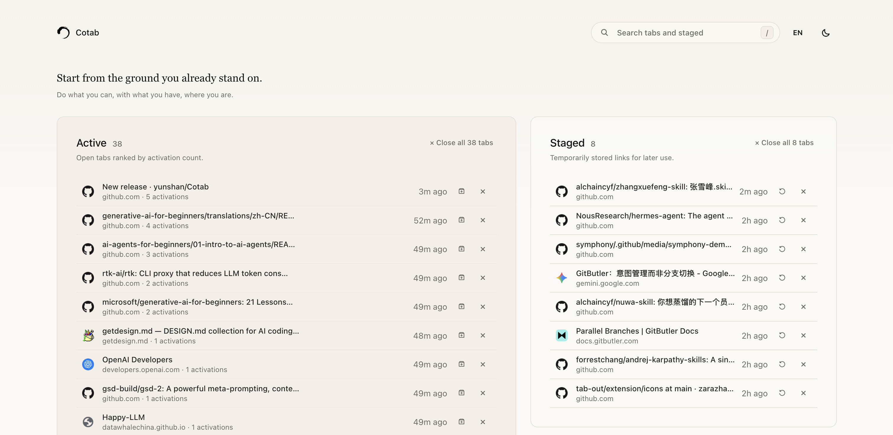

# Cotab


Cotab is a calm Chrome new-tab dashboard for people who live with too many tabs open.

If your browser regularly grows into dozens or hundreds of tabs, closing them can feel strangely risky: one page took effort to find, another might be useful later, and bookmarks feel too permanent for half-formed work. Cotab turns that mess into a lightweight working table: see what you actually use, stage what you may need later, and close the rest with confidence.



## Highlights

- **Active tabs by real usage**: open tabs are ranked by activation count, so frequently used tabs rise naturally.
- **Stage instead of hoard**: store a tab for later use and close the original tab in one click.
- **Close without ceremony**: close individual tabs or bulk-close the currently visible Active list.
- **Focused two-pane layout**: Active takes the main workspace, while Staged sits beside it as a temporary holding area.
- **Search as you type**: filter Active and Staged tabs by title, URL, or domain.
- **Consistent favicons**: Cotab prefers each site's normal favicon so discarded Chrome tabs do not appear as washed-out duplicates.
- **Bilingual interface**: Chinese and English modes, defaulting to the browser or system language.
- **Light and dark themes**: quiet theme controls with local preference storage.
- **Private by default**: no account, no backend, no page snapshots, no browser history scraping.

## Current Extension Info

- **Name**: Cotab
- **Manifest**: Chrome Extension Manifest V3
- **Version**: `0.9.0`
- **New tab override**: yes
- **Permissions**: `tabs`, `storage`, `favicon`
- **Local data**: tab metadata and staged items in `chrome.storage.local`
- **Icons**:
  - `icons/icon16.png`
  - `icons/icon48.png`
  - `icons/icon128.png`
  - source SVG: `icons/icon.svg`

## Install Locally

1. Install dependencies:

   ```bash
   npm install
   ```

2. Build the extension:

   ```bash
   npm run build
   ```

3. Open Chrome and go to:

   ```text
   chrome://extensions
   ```

4. Enable **Developer mode**.

5. Click **Load unpacked** and select the generated `extension/` directory.

6. Open a new tab. Cotab should replace the default Chrome new-tab page.

## Development

```bash
npm install
npm test
npm run build
```

Useful commands:

```bash
npm test        # Run Vitest tests
npm run build   # Type-check and build the MV3 extension into extension/
npm run release:archive # Build and package cotab-v<version>.zip for GitHub Releases
npm run dev     # Start Vite dev mode for UI work
```

After changes, reload the extension from `chrome://extensions` to test the latest `extension/` build.

## Testing

The project uses Vitest for focused behavior tests.

Covered today:

- tab search
- staged item search
- activation-count sorting
- staging/deduping behavior
- title truncation
- language preference fallback and manual override

Run:

```bash
npm test
```

## Release Process

Cotab follows a simple local release discipline:

1. After every requirement change that builds successfully, bump the version by `0.1`.
2. Keep `package.json`, `package-lock.json`, and `public/manifest.json` in sync.
3. Add a dated entry to `release-notes.md`.
4. Run:

   ```bash
   npm test
   npm run build
   ```

5. Confirm `extension/manifest.json` contains the new version.
6. Package and publish the release artifact:

   ```bash
   npm run release:archive
   gh release create v<version> cotab-v<version>.zip --repo yunshan/Cotab --title "Cotab v<version>" --notes-file release-notes.md
   ```

The local repository remote should point to:

```bash
git remote add origin https://github.com/yunshan/Cotab.git
```

## Privacy

Cotab stores only local tab metadata needed for the dashboard:

- title
- URL
- favicon URL
- domain
- activation count
- last accessed time
- staged item metadata

Cotab does **not** use an account, backend, cloud sync, analytics, page-content extraction, screenshots, or Chrome browsing history access.

## Project Structure

```text
public/manifest.json   Chrome extension manifest
src/background.ts      MV3 background service worker
src/lib/               tab rules, storage, message types
src/ui/                React new-tab dashboard
icons/                 source extension icons
release-notes.md       release history
```

## License

Cotab is released under the [MIT License](LICENSE).
